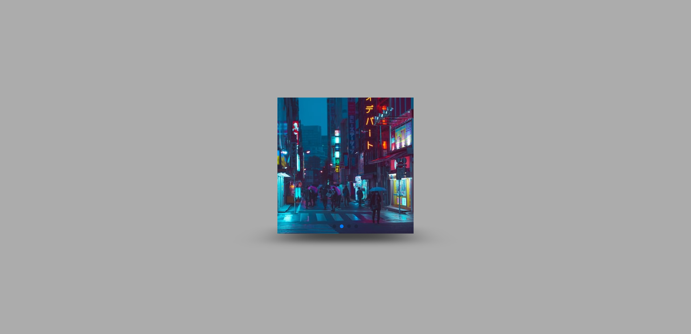

# Slideshow

## Deploy do projeto

<https://slideshow-gabriel-l-santos.vercel.app/>

Projeto feito em HTML, CSS e JavaScript. Foi usado o `SwiperJS` para fazer o efeito de slide 3D, e as imagens, que vem do `Unsplash`, serão aleatórias toda vez que for atualizada a página.

## Tabela de Conteúdos

- [Recursos Usados](#recursos-usados)
- [Autor do Projeto](#autor-do-projeto)

## Recursos Usados

- [SwiperJS](https://swiperjs.com/) - (API usada para fazer o efeito de slide 3D).
- [Unsplash](https://unsplash.com/) - (API usada para exibir as imagens).

## Autor do Projeto

- GitHub - [Gabriel-L-Santos](https://github.com/Gabriel-L-Santos)
- LinkedIn - [Gabriel Leme dos Santos](https://www.linkedin.com/in/gabriel-leme-dos-santos/)